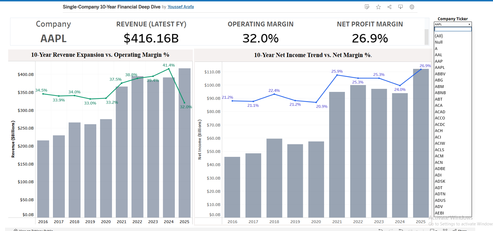
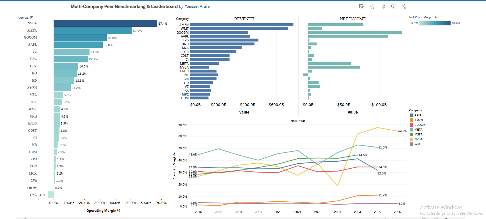

# SEC Financial Filings Pipeline & Multi-Dimensional Tableau Analytics

An end-to-end financial data engineering and business intelligence suite built to extract SEC XBRL filings (FY2016–FY2025), warehouse structured financial statement data in PostgreSQL, and present both single-company historical deep dives and cross-sectional peer benchmarking in Tableau.

<!-- LINK PLACEHOLDER: Live Tableau Public Dashboard Link -->
<!-- Format: [🔗 View Live Dashboards on Tableau Public](https://public.tableau.com/profile/your_username#!/viz/SEC_Full_Analysis) -->

---

## 📸 Executive Visualizations Overview

### 1. Single-Company 10-Year Financial Deep Dive


Tableau Link:
https://public.tableau.com/app/profile/youssef.arafa5693/viz/Single-Company10-YearFinancialDeepDive/Dashboard1?publish=yes

---

### 2. Multi-Company Peer Benchmarking & Leaderboard 


Tableau Link:
https://public.tableau.com/app/profile/youssef.arafa5693/viz/Multi-CompanyPeerBenchmarkingLeaderboard/Dashboard12?publish=yes

## 🛠️ Repository & Project Structure

Based on the core development workspace in VS Code:

```text
SEC_Project/
├── data/                         # Raw SEC XBRL Bulk Data Files
│   ├── num.txt                   # Numeric financial facts
│   ├── pre.txt                   # Presentation layout structure
│   ├── sub.txt                   # Filing submissions metadata
│   └── tag.txt                   # Taxonomy tags & definitions
├── schema/                       # Database DDL & Schema Setup
│   ├── 01_dim_company.sql        # Company dimension table (CIK, Ticker, Name)
│   └── 02_mv_10yr_financials.sql # 10-Year Materialized View
├── queries/                      # Advanced SQL Analytics & Window Functions
│   ├── 01_annual_pl_matrix.sql   # Annual P&L pivot matrix
│   ├── 02_rolling_ttm_revenue.sql# Rolling 4-quarter TTM calculation
│   └── 03_yoy_revenue_growth.sql # YoY percentage growth calculations
├── ingest.py                     # Primary SEC data parser & database loader
├── extract_all.py                # Full batch extraction logic
├── load_all_10yr_data.py         # Multi-year ingestion pipeline script
└── README.md                     # Project documentation

# SEC Financial Filings Pipeline & Multi-Dimensional Tableau Analytics

An end-to-end **financial data engineering and business intelligence suite** built to extract SEC XBRL filings (**FY2016–FY2025**), warehouse structured financial statement data in **PostgreSQL**, and present both **single-company historical deep dives** and **cross-sectional peer benchmarking** in **Tableau**.

<!-- LINK PLACEHOLDER: Live Tableau Public Dashboard Link -->

<!-- Format: [🔗 View Live Dashboards on Tableau Public](https://public.tableau.com/profile/your_username#!/viz/SEC_Full_Analysis) -->

---

## 📸 Executive Visualizations Overview

### 1. Single-Company 10-Year Financial Deep Dive — `Dashboard 1`

<!-- SCREENSHOT PLACEHOLDER: Insert Image 1 here -->

<!--  -->

> **Visualization:** Shows top KPI cards including Company, Revenue, Operating Margin %, and Net Margin %, along with 10-Year Revenue vs. Operating Margin % and 10-Year Net Income vs. Net Margin % dual-axis charts.

---

### 2. Multi-Company Peer Benchmarking & Leaderboard — `Dashboard 1 (2)`

<!-- SCREENSHOT PLACEHOLDER: Insert Image 2 here -->

<!--  -->

> **Visualization:** Shows `Vis_Profitability_Leaderboard` on the left, `Vis_Rev_vs_NetIncome_Conversion` on the top right, and `Vis_MultiYear_Margin_Trend` on the bottom right.

---

## 🛠️ Repository & Project Structure

The project is organized around a Python ETL pipeline, PostgreSQL analytical warehouse, SQL analytics layer, and Tableau visualization suite.

```text
SEC_Project/
├── data/                              # Raw SEC XBRL Bulk Data Files
│   ├── num.txt                        # Numeric financial facts
│   ├── pre.txt                        # Presentation layout structure
│   ├── sub.txt                        # Filing submissions metadata
│   └── tag.txt                        # Taxonomy tags & definitions
│
├── schema/                            # Database DDL & Schema Setup
│   ├── 01_dim_company.sql             # Company dimension table
│   └── 02_mv_10yr_financials.sql      # 10-Year materialized view
│
├── queries/                           # Advanced SQL Analytics
│   ├── 01_annual_pl_matrix.sql        # Annual P&L pivot matrix
│   ├── 02_rolling_ttm_revenue.sql     # Rolling 4-quarter TTM calculation
│   └── 03_yoy_revenue_growth.sql      # YoY percentage growth calculations
│
├── ingest.py                          # Primary SEC data parser & database loader
├── extract_all.py                     # Full batch extraction logic
├── load_all_10yr_data.py              # Multi-year ingestion pipeline
└── README.md                          # Project documentation
```

---

## ⚙️ Data Pipeline Architecture

```text
┌──────────────────────────────┐
│   Raw SEC XBRL Flat Files    │
│  num.txt / sub.txt / tag.txt │
└──────────────┬───────────────┘
               │
               ▼
┌──────────────────────────────┐
│       Python ETL Layer       │
│ ingest.py / load_all_10yr... │
└──────────────┬───────────────┘
               │
               ▼
┌──────────────────────────────┐
│     PostgreSQL Database      │
│ dim_company / mv_10yr_...    │
└──────────────┬───────────────┘
               │
               ▼
┌──────────────────────────────┐
│      SQL Analytics Layer     │
│ TTM / YoY / Margins / Windows│
└──────────────┬───────────────┘
               │
               ▼
┌──────────────────────────────┐
│       Tableau Suite          │
│ Deep Dive / Peer Benchmarking│
└──────────────────────────────┘
```

---
## 🎯 Core Analytical Questions

The project addresses **two distinct sets of core analytical questions**—single-company historical performance and cross-sectional peer benchmarking—supported by the SEC XBRL database pipeline, analytical SQL layer, and Tableau visualization suite.

---

### 1. Single-Company Historical Trajectory — `Dashboard 1`

This dashboard focuses on understanding how an individual company's financial performance has evolved over the **FY2016–FY2025** period.

#### 10-Year Scale vs. Profitability

* How has top-line revenue expanded over the past decade?
* Did operating margins expand or compress alongside revenue growth?
* Is revenue growth being accompanied by improving or deteriorating operational efficiency?

#### Bottom-Line Retention

* Is net income scaling in lockstep with top-line revenue growth?
* Are rising operating or other costs causing Net Profit Margin % to compress?
* Does the company demonstrate improving or declining ability to convert revenue into earnings?

#### Executive Scorecard Baseline

For a selected ticker, such as `ACI`, what are the current baseline financial metrics?

* **Revenue ($B)**
* **Net Income ($B)**
* **Operating Margin (%)**
* **Net Profit Margin (%)**

These metrics provide an executive-level snapshot before analyzing the company's longer-term financial trajectory.

---

### 2. Peer Benchmarking & Sector Analysis — `Dashboard 2`

The peer benchmarking dashboard shifts from **within-company historical analysis** to **cross-sectional comparison** across multiple equities.

#### Structural Margin Rankings

* Which companies demonstrate strong pricing power and high operational efficiency?
* Which companies operate at high volume but comparatively low margins?
* How do high-margin companies such as `NVDA` and `META` compare with lower-margin operators such as `WMT`, `CVS`, and `CNC`?

Example profitability observations include:

* `NVDA` — **67.4%**
* `META` — **51.0%**
* `CNC` — **-3.9%**

These rankings help identify structural differences in profitability and operating efficiency across the peer group.

#### Revenue-to-Net Income Conversion

* Which companies generate massive top-line revenue but retain relatively little as net income?
* Which firms demonstrate stronger conversion of revenue into bottom-line earnings?
* Does revenue scale necessarily translate into superior profitability?

This analysis provides a direct comparison between **revenue scale and earnings retention**.

#### 10-Year Operational Leverage Trends

* How have peer operating margins evolved from **FY2016 through FY2025**?
* Which companies demonstrate sustained margin expansion?
* Which companies experience margin compression or relatively stable operating performance?
* How does `NVDA`'s margin acceleration during the AI hardware cycle compare with more established steady-state businesses such as `MSFT` and `AAPL`?

The multi-year trend analysis provides historical context that a single-year peer ranking cannot capture.

---

### 3. Data Engineering & Pipeline SQL Questions — `queries/`

The underlying data engineering and SQL layer addresses the analytical challenges involved in transforming raw SEC XBRL data into comparable financial metrics.

#### Rolling TTM Analytics

* What is the **Trailing Twelve Month (TTM) revenue** across quarterly SEC filings?
* How can SQL window functions calculate rolling four-quarter revenue?
* How does the `ROWS BETWEEN 3 PRECEDING AND CURRENT ROW` window frame produce the TTM calculation?

The implementation is contained in:

```text
queries/02_rolling_ttm_revenue.sql
```

#### YoY Performance Tracking

* What are the **Year-over-Year (YoY) revenue growth rates** across reporting periods?
* How can revenue be normalized when companies use different SEC XBRL reporting tags?
* How can disparate fiscal periods and XBRL taxonomy tags be transformed into a consistent analytical structure?
* How does YoY growth help distinguish accelerating companies from businesses experiencing slower top-line expansion?

The implementation is contained in:

```text
queries/03_yoy_revenue_growth.sql
```

#### Annual Financial Statement Analysis

The SQL layer also supports annual P&L analysis through:

```text
queries/01_annual_pl_matrix.sql
```

This provides a structured annual view of key financial statement metrics that can be consumed by downstream analytical workflows and Tableau visualizations.

---

## 🔄 From Analytical Questions to Business Insights

The project connects each analytical question to a specific layer of the data and visualization architecture:

| Analytical Question                                         | Data / SQL Layer                               | Tableau Output                    |
| ----------------------------------------------------------- | ---------------------------------------------- | --------------------------------- |
| How has revenue evolved over 10 years?                      | `mv_10yr_financials`                           | `Vis_Revenue_Margin_Trend`        |
| Are operating margins expanding or compressing?             | Financial margin calculations                  | `Vis_Revenue_Margin_Trend`        |
| Is net income keeping pace with revenue?                    | Revenue & net income metrics                   | `Vis_Net_Income_Trend`            |
| What is the company's current financial baseline?           | Aggregated financial metrics                   | `KPI_Cards`                       |
| Which companies have the highest margins?                   | Peer profitability calculations                | `Vis_Profitability_Leaderboard`   |
| Which firms convert revenue into earnings most effectively? | Revenue vs. net income analysis                | `Vis_Rev_vs_NetIncome_Conversion` |
| How have peer margins changed over time?                    | Multi-year financial data                      | `Vis_MultiYear_Margin_Trend`      |
| What is quarterly TTM revenue?                              | SQL window functions                           | Analytical dataset                |
| What is YoY revenue growth?                                 | Fiscal-period normalization & SQL calculations | Analytical dataset                |

---

## 💡 Business Intelligence Value

Together, these analytical layers answer three progressively broader questions:

```text
1. COMPANY
   ↓
How is this individual company performing?

2. PEER GROUP
   ↓
How does the company compare with its competitors?

3. TIME + PEERS
   ↓
How has its relative financial performance evolved over time?
```

This structure allows the project to move beyond simple financial reporting toward **historical trend analysis, profitability benchmarking, operational efficiency analysis, and executive decision support**.

---

## 🗄️ SQL Analytics Logic

The project uses SQL window functions to calculate **Trailing Twelve Month (TTM)** revenue across quarterly SEC filings.

The core query is located in:

```text
queries/02_rolling_ttm_revenue.sql
```

```sql
WITH quarterly_rev AS (
    SELECT 
        v.period_end_date,
        v.fiscal_year,
        v.fiscal_period,
        v.amount_in_millions AS q_revenue
    FROM mv_10yr_financials v
    JOIN dim_company c 
        ON v.cik = c.cik
    WHERE c.ticker IN ('NVDA', 'AAPL', 'MSFT', 'AMZN')
      AND v.qtrs = 1
      AND v.tag IN (
          'Revenues',
          'RevenueFromContractWithCustomerExcludingAssessedTax'
      )
)

SELECT 
    ticker,
    period_end_date,
    fiscal_year,
    fiscal_period,
    ROUND(q_revenue, 2) AS qtr_revenue_millions,

    ROUND(
        SUM(q_revenue) OVER (
            PARTITION BY ticker 
            ORDER BY period_end_date 
            ROWS BETWEEN 3 PRECEDING AND CURRENT ROW
        ),
        2
    ) AS ttm_revenue_millions

FROM quarterly_rev

ORDER BY ticker, period_end_date DESC;
```

### Key SQL Techniques

* **Common Table Expressions (CTEs)** for query organization
* **Window functions** for rolling calculations
* **`PARTITION BY`** to calculate metrics independently for each company
* **`ORDER BY`** to maintain chronological calculations
* **`ROWS BETWEEN 3 PRECEDING AND CURRENT ROW`** to calculate four-quarter TTM revenue
* **`ROUND()`** for presentation-ready financial values

---

## 📊 Tableau Worksheets Breakdown

### Dashboard 1: Single-Company Financial Trajectory


#### `KPI_Cards`

Single-row executive scorecard displaying:

* **Company**
* **Revenue ($B)**
* **Operating Margin (%)**
* **Net Profit Margin (%)**

#### `Vis_Revenue_Margin_Trend`

Dual-axis visualization combining:

* 10-year revenue growth
* Operating margin % fluctuations

This allows users to evaluate whether profitability has expanded or contracted alongside revenue growth.

#### `Vis_Net_Income_Trend`

Dual-axis visualization tracking:

* Net income
* Net profit margin %

This provides a historical view of bottom-line performance and profitability.

#### Controls

The dashboard includes a **Company Ticker** filter that dynamically updates the dashboard worksheets based on the selected company.

---

### Dashboard 2: Executive Peer Benchmark


#### `Vis_Profitability_Leaderboard`

Horizontal bar chart ranking companies based on profitability.

Example peer results include:

* `NVDA` — 67.4%
* `CNC` — -3.9%

This visualization makes it easy to identify high-margin leaders and negative-margin outliers.

#### `Vis_Rev_vs_NetIncome_Conversion`

Comparative visualization contrasting:

* Revenue scale
* Net income

This helps evaluate how effectively companies convert top-line revenue into bottom-line earnings.

#### `Vis_MultiYear_Margin_Trend`

Multi-line time-series visualization tracking margin trajectories from **FY2016–FY2025** across selected companies:

```text
NVDA
META
GOOGM
AAPL
MSFT
AMZN
WMT
```

---

## 🚀 Getting Started

### 1. Environment Setup

Clone the repository and install the required Python libraries.

```bash
git clone https://github.com/your-username/SEC_Project.git

cd SEC_Project

pip install pandas psycopg2 sqlalchemy
```

> **Note:** Replace `your-username` with your actual GitHub username.

---

### 2. Database Initialization

Create the required PostgreSQL database and execute the schema scripts.

Using PostgreSQL or DBeaver:

```sql
\i schema/01_dim_company.sql
\i schema/02_mv_10yr_financials.sql
```

The schema creates the company dimension and the 10-year financial materialized view used by the analytical layer.

---

### 3. ETL Pipeline Execution

Run the Python ingestion scripts from VS Code.

```bash
python ingest.py
```

Then execute the multi-year ingestion pipeline:

```bash
python load_all_10yr_data.py
```

The pipeline processes the SEC XBRL data and loads structured financial information into PostgreSQL.

---

### 4. Run SQL Analytics

The analytical queries are located in:

```text
queries/
├── 01_annual_pl_matrix.sql
├── 02_rolling_ttm_revenue.sql
└── 03_yoy_revenue_growth.sql
```

These queries provide:

| Query                        | Purpose                          |
| ---------------------------- | -------------------------------- |
| `01_annual_pl_matrix.sql`    | Annual P&L analysis              |
| `02_rolling_ttm_revenue.sql` | Rolling four-quarter TTM revenue |
| `03_yoy_revenue_growth.sql`  | Year-over-year revenue growth    |

---

### 5. Tableau Dashboard Access

Open the Tableau workbook:

```text
tableau/SEC_Full_Analysis.twbx
```

Use **Tableau Desktop** or **Tableau Public** to explore the interactive dashboards.

The Tableau suite provides two primary analytical perspectives:

1. **Single-company historical analysis**
2. **Multi-company peer benchmarking**

---

## 🧰 Technology Stack

| Technology     | Purpose                                 |
| -------------- | --------------------------------------- |
| **Python**     | ETL and SEC data processing             |
| **Pandas**     | Data manipulation and transformation    |
| **PostgreSQL** | Financial data warehouse                |
| **SQL**        | Analytical queries and window functions |
| **DBeaver**    | Database management and SQL development |
| **Tableau**    | Business intelligence and visualization |
| **SEC XBRL**   | Source financial filing data            |
| **VS Code**    | Development environment                 |

---

## 📈 Analytical Capabilities

The project enables several dimensions of financial analysis:

### Historical Analysis

Analyze a company's financial performance across a **10-year period (FY2016–FY2025)**.

### Profitability Analysis

Compare:

* Operating margins
* Net profit margins
* Net income
* Revenue growth

### Peer Benchmarking

Compare financial performance across multiple companies within a selected peer group.

### TTM Analysis

Calculate rolling four-quarter revenue using SQL window functions.

### YoY Growth

Measure year-over-year revenue growth across reporting periods.

### Executive Dashboards

Translate complex financial datasets into interactive Tableau dashboards designed for rapid executive-level analysis.

---

## 🎯 Project Objective

The primary objective of this project is to demonstrate an end-to-end **financial data engineering and analytics workflow**, from raw SEC filings through data transformation, relational warehousing, analytical SQL, and executive visualization.

```text
SEC Financial Data
       ↓
Python ETL
       ↓
PostgreSQL
       ↓
SQL Analytics
       ↓
Tableau
       ↓
Financial Insights
```

The resulting platform provides a scalable foundation for analyzing **company performance, profitability trends, revenue growth, and peer benchmarking** using structured SEC financial data.

---

## 📌 Future Enhancements

Potential extensions to the project include:

* Automated SEC filing ingestion
* Incremental data updates
* Additional financial ratios
* Free cash flow analysis
* Balance sheet analytics
* Cash flow statement analytics
* Industry-level benchmarking
* Automated Tableau refreshes
* Additional company coverage
* Cloud-based PostgreSQL deployment
* Scheduled ETL execution


---

## 👤 Author

Youssef Mohamed Sayed Hussein Arafa

Financial Data Engineering & Business Intelligence


```
Github:  https://github.com/CaptainArafa

Linkedin: https://www.linkedin.com/in/youssef-arafa-b13a4728a/
```
